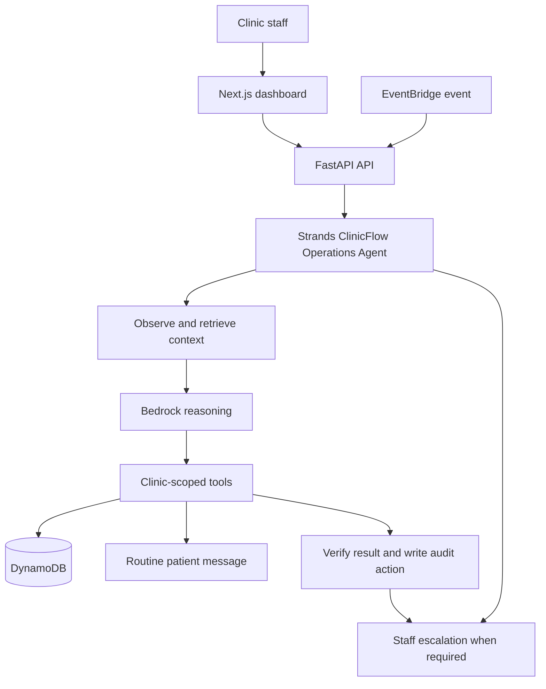

# CareForMe / ClinicFlow

CareForMe is ClinicFlow: an autonomous administrative worker for small outpatient clinics. It handles routine patient follow-up, appointment coordination, reminders, and rescheduling in the background, then escalates clinical or exceptional cases to staff.

**Hackathon track:** Everyday Agents

> Automate the routine. Escalate the exceptional. Never automate clinical judgment.

## What It Does

A clinic administrator can add synthetic patient records and schedule appointments. The Strands agent can then:

- Observe `FOLLOWUP_DUE`, `APPOINTMENT_MISSED`, and other administrative events.
- Retrieve clinic-scoped patient and appointment context.
- Check available appointment slots.
- Send routine administrative messages.
- Book or reschedule appointments and verify the saved result.
- Create pending follow-up tasks.
- Escalate clinical questions, safety concerns, repeated failures, and policy exceptions.
- Record every tool action in the agent audit log.

The product does not diagnose, recommend medication, interpret results, or provide emergency medical advice.

## Architecture



## Stack

- Frontend: Next.js, TypeScript, Tailwind, Ant Design
- API: FastAPI and Pydantic
- Agent: Strands Agents SDK with Amazon Bedrock
- Data: DynamoDB tables for clinics, patients, appointments, tasks, and agent actions
- Events: EventBridge-compatible event endpoint with background processing
- Deployment target: Amazon Bedrock AgentCore Runtime

## Local Setup

Requirements: Python 3.10+, Node.js, an AWS account, and Bedrock model access.

```bash
cd backend
python3 -m venv venv
source venv/bin/activate
pip install -r requirements.txt

cd ../frontend
npm install
```

Configure AWS credentials with an IAM role, `aws configure`, or environment variables. Enable the Bedrock model used by Strands in the selected region.

Backend environment variables:

```text
AWS_REGION=us-east-1
COGNITO_USER_POOL_ID=your_user_pool_id
COGNITO_APP_CLIENT_ID=your_app_client_id
ENV=development
# SMS delivery (leave disabled for local dry-run messages)
TWILIO_ENABLED=false
TWILIO_ACCOUNT_SID=your_twilio_account_sid
TWILIO_AUTH_TOKEN=your_twilio_auth_token
TWILIO_FROM_NUMBER=+15551234567
REMINDER_RUN_TOKEN=generate_a_long_random_token
CLINIC_TIMEZONE=America/New_York
```

Set `TWILIO_ENABLED=true` only after the Twilio number is configured. Patients must have a phone number and `preferred_contact_method=SMS`. Dry-run mode prints SMS payloads without sending them.

For local development, `ENV=development` permits the existing `mock_token_<clinic-id>` token path. Production deployments must use verified Cognito tokens and least-privilege IAM permissions.

## Run Locally

Terminal 1:

```bash
cd backend
source venv/bin/activate
uvicorn main:app --reload
```

Terminal 2:

```bash
cd frontend
npm run dev
```

Open `http://localhost:3000`. Initialize DynamoDB tables with:

```bash
cd backend
python3 database.py
```

## API Workflows

- `POST /api/patients`: add an administrative patient record.
- `GET /api/patients`: list patients for the authenticated clinic.
- `POST /api/appointments`: schedule a patient appointment.
- `PUT /api/appointments/{id}`: reschedule and mark an appointment `RESCHEDULED`.
- `POST /api/events`: queue a background agent event.
- `POST /api/reminders/run`: run due 24-hour and 2-hour appointment reminders. Protect this endpoint with the `X-Reminder-Token` header and invoke it from EventBridge Scheduler or cron every few minutes.
- `POST /api/twilio/inbound`: configure as the Twilio Messaging webhook for inbound replies. Patients can reply `1` to confirm, `2` to request rescheduling, or `STOP` to opt out.
- `GET /api/agent-actions`: view the clinic-scoped audit trail.
- `POST /api/chat`: send an authenticated request to the Strands agent.

## Five-Minute Demo Story

1. Show the dashboard and add synthetic patient Sarah.
2. Schedule a follow-up appointment, then reschedule it from the appointment table.
3. Submit a `FOLLOWUP_DUE` event and show the agent retrieving the patient, checking slots, messaging the patient, and creating or booking the follow-up.
4. Submit an `APPOINTMENT_MISSED` event and show autonomous rescheduling.
5. Send a message containing a clinical concern such as severe chest pain. Show `CLINICAL REVIEW REQUIRED` and the staff escalation instead of medical advice.
6. Open the activity log to show tool calls, results, timestamps, and human handoff.

## Submission Checklist

- [x] New agent built with Strands Agents SDK.
- [x] Real administrative workflow for a defined user: small outpatient clinics.
- [x] Autonomous tool execution with background event handling.
- [x] Human-in-the-loop escalation and explicit clinical safety boundary.
- [x] Architecture diagram in this README.
- [x] Demo path covering routine work, missed appointments, and escalation.
- [ ] Publish this repository at a public URL before submission.
- [ ] Add the final public demo video URL, maximum five minutes.
- [ ] Add the team's AWS Builder ID.
- [ ] Publish the optional build story on builder.aws.com with `Agents for Humans` in the title.

## AWS Resources

- [Strands Agents Quickstart](https://strandsagents.com/docs/user-guide/quickstart/overview/)
- [Strands Agents Examples](https://strandsagents.com/docs/examples/)
- [Amazon Bedrock AgentCore](https://docs.aws.amazon.com/bedrock-agentcore/)
- [Deploy a Strands Agent to AgentCore Runtime](https://aws.github.io/bedrock-agentcore-starter-toolkit/user-guide/runtime/quickstart.html)
