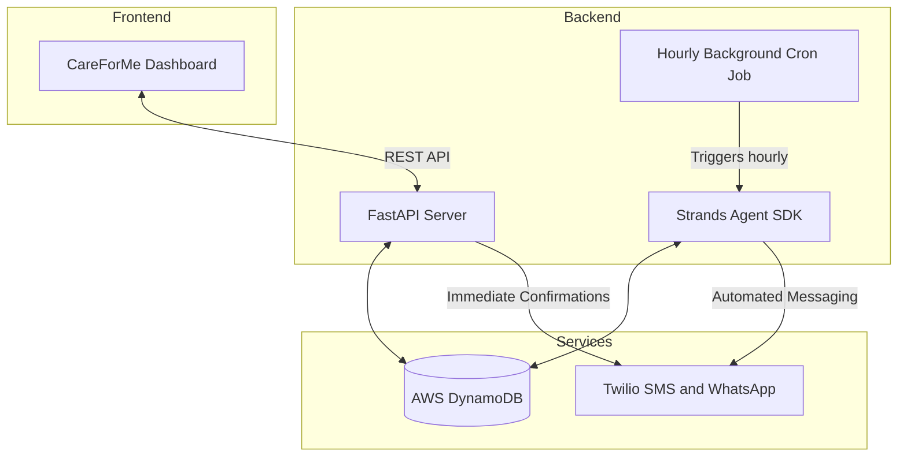

# CareForMe 🩺

**CareForMe** is an autonomous clinic operations agent built for the *Agents for Humans Hackathon*. It acts as a tireless background worker that quietly handles the chaotic, repetitive tasks of clinic management—like scheduling, following up with no-shows, and sending appointment reminders—so doctors and medical staff can focus entirely on patient care.

## 🎯 The Pitch
**The Problem:** Small clinics and independent medical professionals spend hours every day managing scheduling changes, hunting down patients who missed their appointments, and sending manual reminders. This administrative burden leads to burnout and reduced patient care time. 

**Who it's for:** Independent doctors, small medical clinics, and professional healthcare teams (perfect for the *Professional Agents* track).

**Why it matters:** CareForMe takes the mental load off the clinic staff. Instead of giving them another dashboard they have to babysit, CareForMe's agent works autonomously in the background. It watches the calendar, texts patients before their appointments, detects when a patient hasn't shown up, and instantly sends them a compassionate rescheduling text via Twilio WhatsApp/SMS—all without human intervention.

## 🏗️ Architecture



## ⚙️ Tech Stack
* **Frontend:** Next.js (App Router), React, Tailwind CSS, Ant Design
* **Backend:** Python, FastAPI, Uvicorn
* **AI & Agents:** Strands Agent SDK
* **Database:** AWS DynamoDB
* **Notifications:** Twilio (SMS & WhatsApp Sandbox)

## 🚀 Getting Started

### Prerequisites
* Node.js (v18+)
* Python (3.10+)
* AWS Account (DynamoDB access)
* Twilio Account (for SMS/WhatsApp)
* Strands Agent SDK configured

### 1. Backend Setup
```bash
cd backend
python3 -m venv venv
source venv/bin/activate
pip install -r requirements.txt
```
Create a `.env` file in the `backend/` directory with your AWS, Twilio, and Strands credentials.
Start the backend server:
```bash
uvicorn main:app --reload --port 8000
```

### 2. Frontend Setup
```bash
cd frontend
npm install
```
Start the frontend development server:
```bash
npm run dev
```
Navigate to `http://localhost:3000` to view the dashboard!

### 3. Background Agent Automation
CareForMe relies on an autonomous background worker to handle missed appointments and reminders. To run the background cron job manually (or via your deployment server's cron scheduler):
```bash
cd backend
python3 run_agent_cron.py
```

## 📄 License
This project is licensed under the MIT License - see the [LICENSE](LICENSE) file for details.
