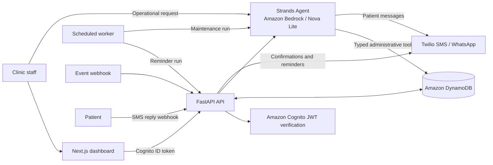

# CareForMe

> An autonomous, safety-bounded clinic operations agent built with the [Strands Agents SDK](https://strandsagents.com/) and Amazon Bedrock for the **Agents for Humans Hackathon**.

CareForMe handles the administrative work that keeps small clinics running: appointment coordination, patient reminders, no-show follow-up, and escalation of exceptions to human staff. It is designed to work in the background, take real actions through tools, and leave an auditable record of what it did.

**Track:** Professional Agents

**AWS Builder ID:** bellooluwabambo6@gmail.com

## The problem

Small clinics and independent practitioners lose substantial time to operational work: confirming appointments, chasing no-shows, handling reschedule requests, and monitoring follow-up queues. These tasks are repetitive, time-sensitive, and easy to miss when staff are focused on patient care.

Most scheduling products provide another dashboard for staff to monitor. CareForMe is different: it is an agent that can inspect the clinic schedule, identify routine work, contact opted-in patients, update operational records, and surface only the cases that require human judgment.

## Who it is for

- Independent doctors and small clinics
- Front-desk and clinic operations teams
- Healthcare teams that need administrative automation without delegating clinical decisions to AI

## Why it matters

Every missed confirmation, forgotten reminder, or unattended no-show increases staff workload and can delay care. CareForMe reduces that operational burden while retaining a firm human-in-the-loop boundary for medical, safety, and exceptional cases.

## What CareForMe does

- Creates and reschedules appointments
- Sends appointment confirmations and timed SMS/WhatsApp reminders
- Receives patient replies: confirm, request rescheduling, or opt out
- Detects appointments that have passed and initiates no-show follow-up
- Finds available appointment slots and books routine visits through agent tools
- Creates follow-up tasks for clinic staff
- Escalates medical or safety-related questions to human staff instead of providing clinical advice
- Records each agent tool action in an audit log visible in the dashboard

## Safety boundary

CareForMe is an **administrative operations agent**, not a clinician. Its system instructions prohibit it from:

- diagnosing patients;
- recommending or changing medication;
- interpreting medical results; or
- providing medical advice.

When a patient reports symptoms or asks for medical guidance, the agent creates a `REQUIRES_HUMAN_REVIEW` escalation for clinic staff. Routine scheduling and messaging remain automated; clinical judgment remains with people.

## How it works



### End-to-end workflow

1. A clinic administrator registers and signs in with Amazon Cognito.
2. Staff create patient records, doctors, and appointments in the CareForMe dashboard.
3. The backend stores clinic-scoped records in DynamoDB and sends an appointment confirmation to opted-in patients through Twilio.
4. A patient can reply `1` to confirm, `2` to request rescheduling, or `STOP` to opt out. The inbound webhook updates the appointment or creates an operational task.
5. A scheduled worker runs reminder delivery and wakes the Strands agent for background maintenance.
6. The agent checks past appointments, sends a compassionate follow-up where appropriate, and updates the appointment status. It can also find slots, book appointments, create follow-ups, or escalate cases through its tools.
7. Every tool call is persisted as an agent action so staff can review what happened.

## Agent implementation

The agent is built with the Strands Agents SDK and an Amazon Bedrock model (Amazon Nova Lite by default). It does not merely generate responses: it has tools that read and modify real application state.

| Tool capability | Outcome |
| --- | --- |
| Retrieve patient information | Reads a clinic-scoped administrative record |
| Check pending escalations | Shows cases awaiting human review |
| Find available slots | Computes unbooked schedule slots |
| Book or reschedule an appointment | Persists scheduling changes and sends confirmation |
| Send a patient message | Uses Twilio when the patient has opted in |
| Create a follow-up task | Adds a task and contacts the patient |
| Escalate to staff | Creates a human-review task for clinical/safety cases |
| Check past appointments | Finds unattended appointments for follow-up |
| Mark appointment status | Updates operational status such as `NO_SHOW` |

The agent is reachable in two ways:

- **Staff-directed:** authenticated staff can ask it to complete administrative work in the dashboard chat.
- **Autonomous:** `run_agent_cron.py` wakes it for each clinic to perform scheduled maintenance without a staff prompt.

## Technology

| Layer | Technology |
| --- | --- |
| Web application | Next.js, React, TypeScript, Tailwind CSS, Ant Design |
| API | Python, FastAPI, Uvicorn |
| Agent | Strands Agents SDK, Amazon Bedrock, Amazon Nova Lite |
| Identity | Amazon Cognito |
| Operational data | Amazon DynamoDB |
| Messaging | Twilio SMS / WhatsApp |
| Scheduling | External cron scheduler running `run_agent_cron.py` |

## Repository structure

```text
careforme/
├── backend/
│   ├── agent.py              # Strands agent and safety/system instructions
│   ├── tools.py              # Agent tools and audit logging
│   ├── main.py               # FastAPI routes and webhooks
│   ├── database.py           # DynamoDB data access
│   ├── notifications.py      # Reminder and appointment messaging flows
│   ├── messaging.py          # Twilio delivery or local dry run
│   └── run_agent_cron.py     # Scheduled autonomous maintenance worker
├── frontend/
│   └── src/app/              # Next.js landing page, dashboard, and workflows
└── README.md
```

## Run locally

### Prerequisites

- Python 3.10 or newer
- Node.js 18 or newer
- An AWS account with Bedrock model access and DynamoDB permissions
- A Cognito User Pool and app client
- A Twilio account for live SMS/WhatsApp delivery (optional for local dry-run mode)

### 1. Configure the backend

```bash
cd backend
python3 -m venv venv
source venv/bin/activate
pip install -r requirements.txt
```

Create `backend/.env` with values appropriate for your AWS and Twilio environment:

```dotenv
AWS_REGION=us-east-1
BEDROCK_MODEL_ID=amazon.nova-lite-v1:0
COGNITO_USER_POOL_ID=us-east-1_example
COGNITO_APP_CLIENT_ID=exampleclientid
CLINIC_TIMEZONE=Africa/Lagos
REMINDER_RUN_TOKEN=replace-with-a-long-random-secret

# Keep false to print messages locally instead of delivering them.
TWILIO_ENABLED=false
TWILIO_ACCOUNT_SID=
TWILIO_AUTH_TOKEN=
# An SMS-capable Twilio number. Used when a patient selects SMS.
TWILIO_SMS_FROM_NUMBER=
# A Twilio WhatsApp sender, for example whatsapp:+14155238886. Used when a patient selects WhatsApp.
TWILIO_WHATSAPP_FROM_NUMBER=
```

Patients choose **SMS** or **WhatsApp** when they are added. CareForMe uses that saved preference for confirmations, reminders, agent messages, and follow-ups. Configure both sender numbers to support both delivery options.

The API creates its DynamoDB tables at startup. Start it with:

```bash
uvicorn main:app --reload --port 8000
```

### 2. Configure and start the frontend

Create `frontend/.env.local`:

```dotenv
NEXT_PUBLIC_USER_POOL_ID=us-east-1_example
NEXT_PUBLIC_USER_POOL_CLIENT_ID=exampleclientid
```

Then run:

```bash
cd frontend
npm install
npm run dev
```

Open `http://localhost:3000`.

> The deployed frontend currently targets the Render API URL used by the project. For a fully local browser workflow, update the frontend API base URL to your local API endpoint or deploy the backend and frontend with matching configuration.

### 3. Run autonomous maintenance

With the backend running, use a server scheduler or run this manually:

```bash
cd backend
source venv/bin/activate
python3 run_agent_cron.py
```

## Planned EventBridge architecture

CareForMe currently uses `run_agent_cron.py` to scan each clinic for reminders and appointments that need follow-up. The planned next step is to add **Amazon EventBridge Scheduler** so each appointment can trigger work at its exact due time rather than waiting for the next batch run.

The implementation plan is:

1. When an appointment is created or rescheduled, the API will create or update one-time EventBridge schedules for its 24-hour, 2-hour, and 10-minute reminders, as well as a post-appointment follow-up check.
2. At each scheduled time, EventBridge will deliver an event containing the clinic ID, patient ID, appointment ID, and event type to the CareForMe event endpoint.
3. The API will validate the event and run the appropriate workflow: send a reminder, check an unattended appointment, or wake the Strands agent for administrative follow-up.
4. DynamoDB's existing notification claims will continue to make delivery idempotent, preventing duplicate messages if an event is retried.
5. If an appointment is rescheduled or cancelled, the API will replace or remove its corresponding EventBridge schedules.

The existing batch worker will remain as a recovery sweep for work missed during an outage. Amazon EventBridge Scheduler is a planned enhancement; it is not yet part of the deployed implementation.
